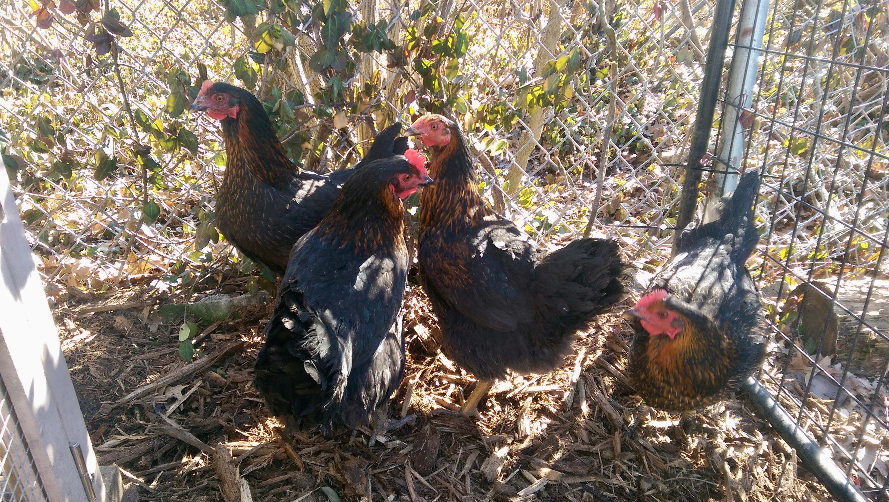
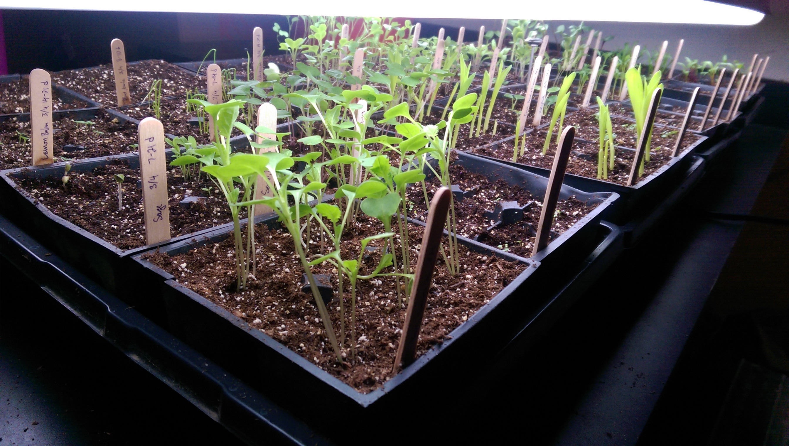
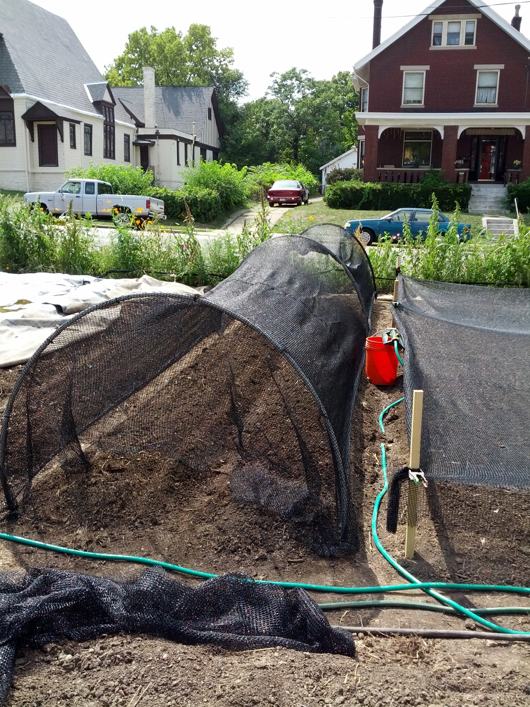
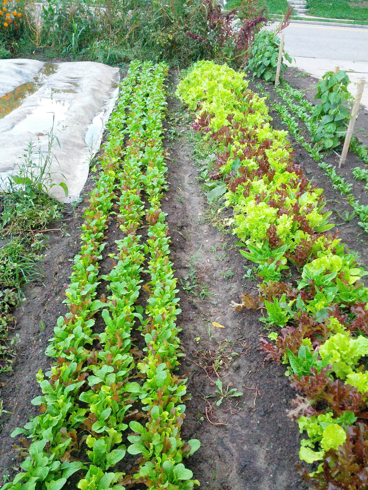
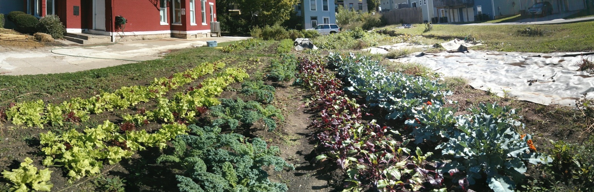
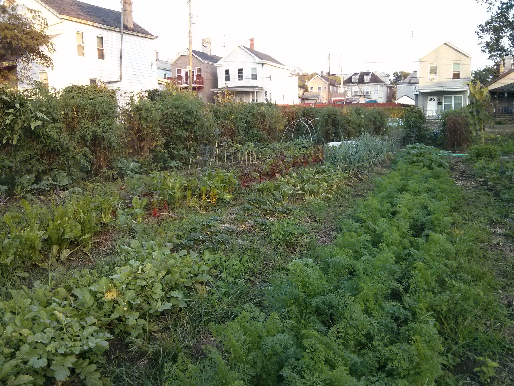
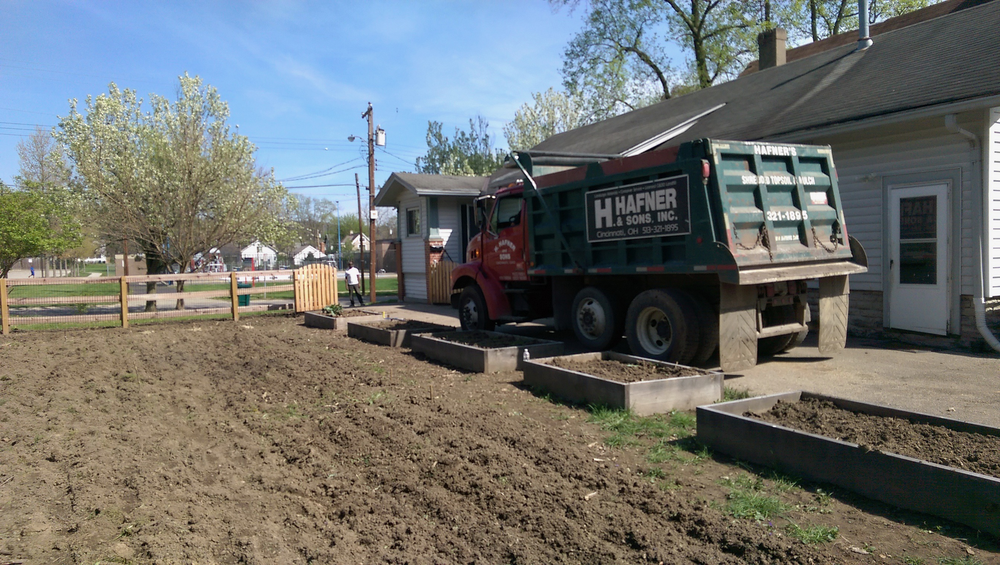
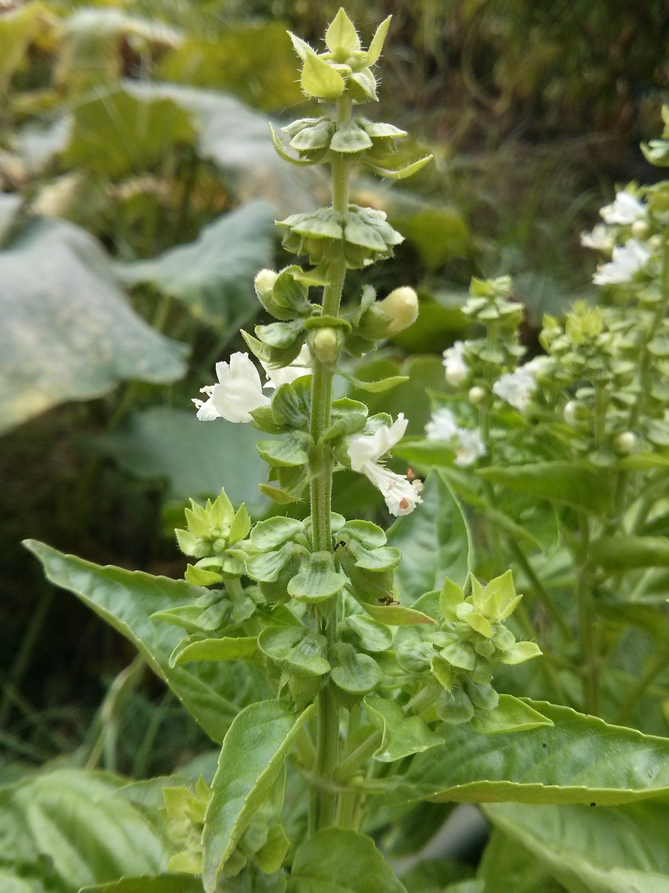
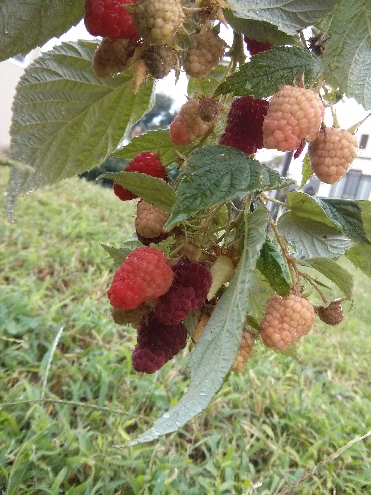

|  | 
|:--:|:--:|
| *Our family's backyard chickens* | *Seed starting indoors for my garden* |

|  | 
|:--:|:--:|
| *Sewing seeds in the heat using shade cloth* | *Luscious salad greens* |

|  |
|:--:|
| *My 3,000 square foot urban garden in Walnut Hills* |

|  |
|:--:|
| *One of the plots at Urban Greens - a farm in the East End in which I invested and helped manage* |

|  | 
|:--:|
| *Delivering top soil to a garden that I was building in Madisonville* 

|  | 
|:--:|:--:|
| *A basil plant going to seed* | *Raspberries from my Walnut Hills garden* |

---